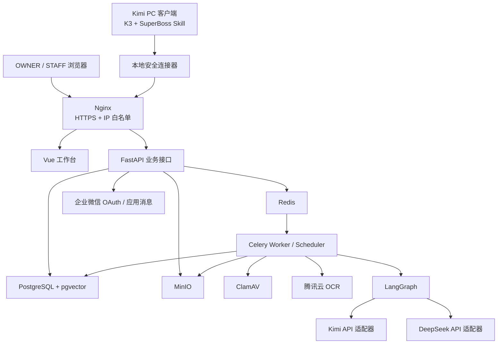

# SuperBoss 技术定型设计

> 版本：v1.0  
> 日期：2026-08-09  
> 状态：各设计章节已获 OWNER 口头批准，等待书面复核  
> 对应需求：[01-需求定稿.md](../../01-需求定稿.md)  
> 对应原架构：[02-架构设计.md](../../02-架构设计.md)

## 1. 设计目标

SuperBoss 是面向唯一 OWNER 和不超过 9 名 STAFF 的公司内部工作台。技术设计优先保证：

1. 权限与财务安全，不依赖前端隐藏或模型自觉。
2. 小团队场景下易部署、易维护，不引入不必要的微服务。
3. Kimi PC 客户端与工作台形成稳定的文档处理闭环。
4. Kimi、DeepSeek、腾讯云 OCR 等外部能力可替换，不绑定单一供应商。
5. 所有模型输出先成为草稿，关键操作必须由 OWNER 确认。

## 2. 冻结的技术路线

| 领域 | 定型选择 | 说明 |
|---|---|---|
| 前端 | Vue 3 + Element Plus | 适合表格、表单、工作台和双角色后台 |
| 后端 | FastAPI | 业务接口与 Python 文档/AI 生态统一 |
| 异步任务 | Celery + Redis | 执行 OCR、扫描、归纳、提醒和导出任务 |
| 数据库 | PostgreSQL + pgvector | 保存业务数据、审计数据及向量索引 |
| 文件存储 | MinIO | 保存原始文件、修订版、分析附件和导出文件 |
| Agent 编排 | LangGraph，有限使用 | 仅用于 OWNER 对话、归纳及人工审批流程 |
| OCR | 腾讯云 OCR 优先 | 第一阶段降低本地推理维护成本，保留 PaddleOCR 适配接口 |
| 模型 | Kimi + DeepSeek 双 API | 按任务路由并互为备用，模型标识通过配置管理 |
| 接入层 | Nginx | 负责 HTTPS、IP 白名单、限流和反向代理 |
| 部署 | Docker Compose | 单机 4C8G 部署，保持组件数量可控 |

Kimi PC 客户端当前由 OWNER 使用 K3 完成日常办公与首轮文档处理。工作台不硬编码 `K3` API 模型名；Kimi 开放平台实际可调用的模型标识由服务器配置决定，避免客户端产品名与 API 型号不一致导致系统失效。

## 3. 总体架构

### 3.1 单体边界

后端保持一个代码项目，不拆分为独立业务微服务。同一份后端代码运行为三个进程：

- API 进程：处理登录、权限校验和即时业务请求。
- Worker 进程：处理 OCR、文档解析、模型调用、病毒扫描和导出。
- Scheduler 进程：处理项目节点、待办、备份检查和定时提醒。

三个进程复用同一套业务规则和权限模块，避免不同服务对规则产生不同理解。

### 3.2 组件职责

- Vue 工作台：展示 OWNER/STAFF 双形态界面，不承担最终权限判断。
- FastAPI：唯一业务入口，负责认证、权限、事务、审计和任务派发。
- Celery：只处理已登记的后台任务，不直接接受公网请求。
- LangGraph：保存 Agent 工作状态和人工确认节点，不直接绕过业务服务写库。
- PostgreSQL：业务事实的唯一可信来源。
- MinIO：文件内容的唯一生产存储，数据库只保存文件元数据和对象键。
- Redis：缓存、任务队列、幂等锁和短期进度，不作为长期业务事实来源。

## 4. Kimi PC 客户端连接

### 4.1 连接构成

连接由两部分组成：

- `SuperBoss Skill`：规定 K3 应输出的内容、格式、确认步骤和错误处理。
- 本地安全连接器：执行认证、文件上传、断点续传、重试和状态查询。

Skill 是工作说明书，连接器是实际传送工具。任何长期密钥都不得写入 `SKILL.md`。

### 4.2 设备配对

1. OWNER 在工作台生成一次性配对码。
2. 连接器使用配对码登记本机，并取得仅限 Kimi 导入的设备凭据。
3. 凭据保存在 Windows 安全凭据区。
4. 连接器使用短期访问令牌和可吊销的续期凭据。
5. 每次请求都检查设备是否启用、OWNER 是否启用及来源网络是否允许。
6. OWNER 可查看设备名称、首次授权时间、最近使用时间并立即吊销。

设备凭据仅允许：创建导入任务、上传该任务附件、提交 K3 成果、查询该任务状态。它不能浏览云盘、读取财务、管理用户、调用通用 Agent 或执行审批。

### 4.3 K3 成果包

每次提交包含：

- 项目和文档标识；新文档可暂不提供文档标识。
- 原版文件、修改版文件或其文件指纹。
- 作为修改基础的版本号和基础文件指纹。
- K3 原始输出，不经工作台改写。
- 修改细节、知识要点、风险/待确认事项、建议标题和标签。
- Kimi 客户端记录的模型标签、处理时间和本地任务编号。
- 全局幂等键，用于防止断线重试造成重复版本。

工作台必须保存原始成果包，再生成标准化版本。若没有原文或修改版可供核对，相关内容标记为“外部模型归纳，未与原文核对”。

### 4.4 提交流程

1. K3 完成修改或分析。
2. Skill 生成结构化成果并向 OWNER 展示发送预览。
3. OWNER 确认项目、文档和基础版本。
4. 连接器上传文件与成果包，服务端返回任务编号。
5. 文件进入隔离区并接受 ClamAV 扫描。
6. Worker 校验文件指纹、基础版本和成果字段。
7. 工作台生成差异结果、版本说明卡和知识卡草稿。
8. OWNER 在工作台确认归档、定稿或发布。

保留普通手工上传与粘贴入口，作为 Kimi 客户端升级、技能失效或网络异常时的备用通道。

## 5. 模型与 OCR 路由

### 5.1 基本分工

- Kimi：长文档理解、修改归纳及需要延续 OWNER 办公习惯的任务。
- DeepSeek：分类、标签、待办汇总、结构化整理和回复草稿。
- 腾讯云 OCR：扫描件、截图、采购凭证和票据文字提取。
- 固定程序：权限判断、版本号、金额计算、入账、发布和审计。

默认不对同一任务同时调用两个模型。只有以下情况启动第二模型复核：

- OWNER 明确要求复核。
- 第一模型输出缺少必填项或自相矛盾。
- 任务规则将其标记为高风险内容。

Kimi 内容不会默认整份转发给 DeepSeek。跨模型处理遵循最少数据原则，只发送完成复核所需的片段。

### 5.2 适配层

模型和 OCR 调用统一经过服务端适配层。适配层负责：

- 当前模型名称、地址和密钥配置。
- 请求和结构化结果转换。
- 超时、限流、重试和备用供应商切换。
- 调用时间、供应商、模型、任务、耗用量和结果版本审计。

业务模块不得直接引用某一供应商的 SDK 数据结构。切换模型不能改变权限、审批和正式业务规则。

### 5.3 Agent 安全边界

LangGraph 只编排对话、文档归纳、待办草稿和人工确认状态。Agent 工具调用必须携带调用者身份，并再次通过业务服务校验。

以下操作只能生成草稿，不能由模型直接完成：

- 正式入账或更改已确认账目。
- 发布知识卡或向员工发送内容。
- 文档定稿。
- 账号创建、禁用和权限调整。
- 完整财务数据导出。
- Kimi 新设备授权。

## 6. 身份与权限

### 6.1 OWNER

- 系统仅允许一个 OWNER。
- OWNER 的企微 userid 在初始化配置中确定，并在数据库中保存唯一约束。
- 普通账号管理接口不能删除、禁用、降级或替换 OWNER。
- OWNER 变更不作为日常产品功能，必须通过服务器维护流程和双重确认执行。

### 6.2 登录与会话

- 系统不提供公开注册页，浏览器用户必须通过企业微信 OAuth 登录并匹配内部白名单。
- 用户会话采用 Access Token 2 小时、Refresh Token 14 天的双 Token 方案。
- Refresh Token 每次使用后轮换；退出登录、账号禁用或离职操作立即吊销现有续期凭据。
- 权限和项目成员关系以服务端当前数据为准，不因旧 Token 中残留角色而继续生效。
- Kimi 设备凭据与浏览器用户会话分开管理，不能相互替代。

### 6.3 STAFF

- STAFF 只能访问所属项目的资料、学习内容和自己的提交。
- 所有项目型业务查询通过统一查询层注入项目范围，不能依赖开发者手工追加条件。
- 用户、会话、系统配置等非项目型数据采用各自的显式策略，不伪造无意义的 `project_id`。
- 成本、利润、收益及 Agent 数据在接口层拒绝 STAFF，不仅从页面隐藏。
- 文件下载前重新检查用户、项目和对象权限，再签发短有效期下载地址。

### 6.4 OWNER 自建 STAFF 测试账号

- 使用一个独立白名单账号和独立企业微信 userid，角色固定为 STAFF。
- 测试账号不拥有隐藏特权，必须经过与真实员工完全相同的接口和权限链。
- 测试数据放入明确标记的“验收测试项目”；项目保存 `is_test` 标记，正式报表默认且强制排除测试项目。
- 建议使用独立浏览器配置或无痕窗口登录，避免 OWNER 与 STAFF 会话混用。
- 生产环境不提供“伪装成员工”或绕过登录的一键角色切换；页面预览不能替代真实账号验收。

### 6.5 审计

上传、下载、版本变更、模型处理、入账、审批、账号变更、设备配对和越权拒绝均写入审计日志。审计日志记录操作者、设备、时间、对象、变更前后、结果和失败原因，普通业务接口不能修改或删除。大段文件内容和完整模型输入不直接复制进审计日志；日志保存受保护结果记录的引用和内容指纹，实际内容按权限存入专用记录表。

### 6.6 数据模型补充

在原需求核心表基础上增加以下职责明确的记录：

| 记录 | 用途 |
|---|---|
| `auth_sessions` | Refresh Token 轮换、设备和吊销状态 |
| `device_connections` | Kimi 连接设备、授权范围、最近活动与吊销时间 |
| `import_jobs` | K3 成果包、幂等键、基础版本和处理状态 |
| `model_runs` | 模型供应商、模型标识、输入输出引用、耗用量和结果状态 |
| `approval_actions` | OWNER 对定稿、发布、入账、回复和设备授权的确认记录 |
| `notification_deliveries` | 企业微信消息的发送、重试和去重状态 |

上述记录名称是实现基线；实施计划可以调整物理表拆分，但不得合并掉设备吊销、幂等、模型追溯或人工审批能力。

## 7. 文档版本与知识流

1. 初版文件进入版本链后锁定，不允许覆盖。
2. 修订必须引用基础版本，形成 v2 至 vn。
3. 服务端用实际文件内容生成机械差异；K3 修改说明作为独立证据保存。
4. 霜月将机械差异和 K3 成果整理为不超过三条的版本要点及版本说明卡。
5. 知识要点先进入待审核状态。
6. OWNER 确认后才可发布至学习库。
7. OWNER 标记定稿后，生成最终版与初版的逐段差异归纳报告。

扫描 PDF 先 OCR，再做文本对比。识别置信度不足或关键段落无法对应时，报告必须展示警告，不得伪装为完整对比。

## 8. 异常处理与一致性

### 8.1 上传与断线

- 分片上传支持断点续传。
- 本地连接器在收到服务端完整确认前保留待发送任务。
- 幂等键和文件指纹保证重复发送不会产生重复版本。
- 基础版本不匹配时暂停归档，由 OWNER 选择合并、另建版本或放弃。

### 8.2 文件、OCR 与模型错误

- 文件损坏或病毒扫描失败时保持隔离并通知 OWNER。
- OCR 和模型短暂故障采用有限次数、带间隔的自动重试。
- 主供应商持续失败时切换备用供应商。
- 所有供应商均失败时转为 OWNER 待办，不报告虚假成功。
- 不完整或不符合格式的模型输出只能保存为待修复草稿。

### 8.3 财务一致性

成本确认和公司流水写入在同一数据库事务中完成：全部成功才显示已入账，任一步失败则全部不生效。确认接口使用幂等键，重复点击不产生重复流水。

已确认账目不得覆盖式修改。更正必须保存原值、新值、原因、操作者和时间。

### 8.4 消息提醒

工作台待办是正式记录，企业微信只是通知通道。企微发送失败自动重试；重复重试使用同一消息键，避免多次发送。持续失败时在 OWNER 端展示通知异常。

## 9. 备份、恢复与部署

### 9.1 备份

- PostgreSQL 持续保留恢复日志，每日生成完整备份。
- 通过病毒扫描的文件异步复制到腾讯云 COS 冷备。
- MinIO 每日与 COS 执行对象清单核对。
- 备份使用独立于生产环境的访问密钥并加密保存。
- 保留最近 7 天每日备份、最近 4 周每周备份和最近 12 个月月度备份。
- 每月执行一次真实恢复演练并记录结果。

恢复目标：数据库最多丢失约 15 分钟内尚未同步的变更，核心工作台在正常资源条件下 4 小时内恢复。文件以已完成的异步冷备为恢复边界。

### 9.2 更新与回滚

“立即更新”执行：拉取代码、构建新镜像、备份数据库、运行向后兼容的 migration、启动新版本、健康检查、切换流量。健康检查失败时切回上一应用镜像并生成 OWNER 待办。

数据库 migration 必须优先采用先扩展、后迁移、最后清理的兼容策略。应用镜像回滚不等同于盲目逆向回滚数据库。

## 10. 测试与验收

### 10.1 自动化测试

- 单元测试：权限策略、财务计算、版本规则、模型结果校验。
- 集成测试：PostgreSQL、Redis、MinIO、Celery 任务及事务一致性。
- 接口测试：OWNER/STAFF/设备凭据权限矩阵和越权访问。
- 端到端测试：企微登录、文件上传、Kimi 导入、审批、下载和员工提交。
- 故障测试：断网、重复提交、模型超时、OCR 失败、企微失败和任务重启。

### 10.2 必须通过的验收场景

- OWNER 无法通过普通界面或 API 被删除、禁用或降级。
- STAFF 直接请求敏感接口仍被拒绝，且只能看到所属项目数据。
- OWNER 的独立 STAFF 测试账号完整通过真实员工权限链。
- Kimi 导入中断后可继续，同一成果重复发送不产生重复版本。
- 基于旧版本的成果触发冲突处理，不静默覆盖新版本。
- 无原文核验的知识点展示明确警告。
- 模型和 OCR 全部不可用时，系统停在人工处理状态。
- 金额必须人工确认；重复确认不产生重复成本或流水。
- 使用人工 Excel 与系统财务报表交叉核对。
- 从空环境实际恢复数据库和文件，并验证关联关系。
- 人为制造部署失败，确认可以恢复上一可用应用版本。
- 密钥不出现在代码、日志、浏览器输出或普通备份说明中。

真实 OCR 和文档验收使用公司的代表性样本，不用模型宣传指标代替业务验收。模型准确率永远不构成取消人工确认的理由。

## 11. 分阶段上线

### M1：基础闭环

- Git 仓库和工程骨架。
- Docker Compose 基础部署。
- OWNER 企业微信登录与白名单。
- 项目、基础云盘、审计日志。
- Kimi 设备配对与最小成果提交链路。
- 仅 OWNER 使用和验收。

### M2：文档智能

- 完整文档版本链。
- K3 成果导入和差异核验。
- Kimi/DeepSeek 双 API 适配。
- OCR、知识卡、版本说明卡和定稿差异报告。

### M3：员工协作

- STAFF 登录、资料库、学习库和“我的提交”。
- 员工提问、排班解析、项目时间线和 OWNER 待办。
- OWNER 使用独立 STAFF 测试账号完成验收后再开放真实员工。

### M4：财务

- 成本凭证、人工确认入账、公司流水收益表和异常提醒。
- 与现有 Excel 平行记账并交叉核对，验收通过后再作为正式数据源。

### M5：正式上线

- 企业微信消息、部署回滚、备份恢复演练。
- 域名与证书切换。
- Q 版吐槽小人及最终体验打磨。

## 12. 非目标与约束

- 不对外开放，不提供公开注册。
- 不建设 ADMIN 或其他管理层级。
- 不为 STAFF 提供任何大模型对话入口。
- 第一阶段不拆微服务，不部署 Kubernetes。
- 第一阶段不自建 PaddleOCR 推理服务，只保留替换能力。
- 不允许模型直接执行财务、发布、账号或权限操作。
- 不提供生产环境 OWNER 一键伪装 STAFF 的越权测试功能。

## 13. 后续文档拆分

本文件是全局技术基线，不直接作为整个项目的一次性编码任务。后续按里程碑分别形成设计补充和实施计划，首先为 M1 编写可逐项验收的实施计划。后续设计不得违反本文件冻结的身份、权限、审批、审计和模型安全边界；如需变更，必须由 OWNER 明确批准并记录设计版本。

## 14. 参考资料

- [Vue 官方介绍](https://vuejs.org/guide/introduction.html)
- [FastAPI 官方特性](https://fastapi.tiangolo.com/features/)
- [Celery 官方文档](https://docs.celeryq.dev/en/main/index.html)
- [LangGraph 官方介绍](https://langchain-ai.github.io/langgraph/index.html)
- [Kimi Work 官方介绍](https://www.kimi.com/zh-cn/products/kimi-work)
- [Kimi Agent Skills 文档](https://github.com/moonshotai/kimi-cli/blob/main/docs/en/customization/skills.md)
- [DeepSeek API 文档](https://api-docs.deepseek.com/zh-cn/)
- [腾讯云 OCR 文档](https://cloud.tencent.com/document/product/866/33514)
